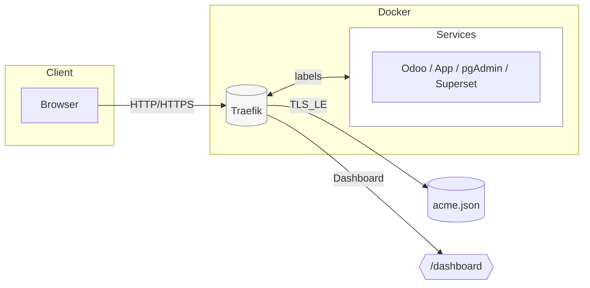

# 🚀 Traefik Copier Template


[](https://www.docker.com/)
[](#)
[](LICENSE)
[](https://openai.com/)

## 📖 Overview

This project provides a **Copier template** to quickly scaffold a
Traefik setup using Docker and Docker Compose.\
It is designed to support both **local development** and **production
deployment** with SSL and Let's Encrypt.

## ✨ Features

-   🐳 Docker Compose setup split into `common`, `devel`, and `prod`
-   🌍 Local domain: `*.localhost`
-   🔐 Production domain: `*.simetri-sinergi.id`
-   🔒 Automatic SSL certificates via Let's Encrypt
-   📊 Traefik Dashboard available in local and production (with
    password protection)
-   ⚡ Ready-to-use scripts (`up.sh` and `down.sh`) for managing the
    stack

## 📂 Project Structure

    .
    ├── README.md
    ├── copier.yml
    ├── scripts
    │   ├── up.sh
    │   └── down.sh
    ├── traefik
    │   ├── traefik.yml
    │   ├── dynamic/
    │   └── acme.json
    └── {{ project_slug }}/
        ├── docker-compose.common.yaml
        ├── docker-compose.devel.yaml
        └── docker-compose.prod.yaml

## 🗺️ Architecture



**Notes:**
- **Local**: domain `*.localhost` (no HTTPS), dashboard accessible without auth.  
- **Production**: domain `*.simetri-sinergi.id`, HTTPS via Let’s Encrypt, dashboard protected with basic-auth.

## ⚙️ Usage

### 1. Generate Project

``` bash
copier copy gh:simetri-sinergi/traefik-copier-template my-traefik-stack
cd my-traefik-stack
```

### 2. Local Development

``` bash
sudo docker compose -f docker-compose.common.yaml -f docker-compose.devel.yaml up -d
```

-   Access dashboard at 👉 <http://traefik.localhost>

### 3. Production Deployment

``` bash
sudo docker compose -f docker-compose.common.yaml -f docker-compose.prod.yaml up -d
```

-   Access dashboard at 👉 <https://traefik.simetri-sinergi.id>\
    (username: `admin`, password: `admin1234`)

## 🔑 Configuration

-   SSL email: `odoo@simetri-sinergi.id`
-   Local domain: `traefik.localhost`
-   Production domain: `traefik.simetri-sinergi.id`

## 📜 License

This project is licensed under the MIT License.\
See [LICENSE](LICENSE) for details.

---

💡 Generated with the help of [ChatGPT](https://openai.com/)
